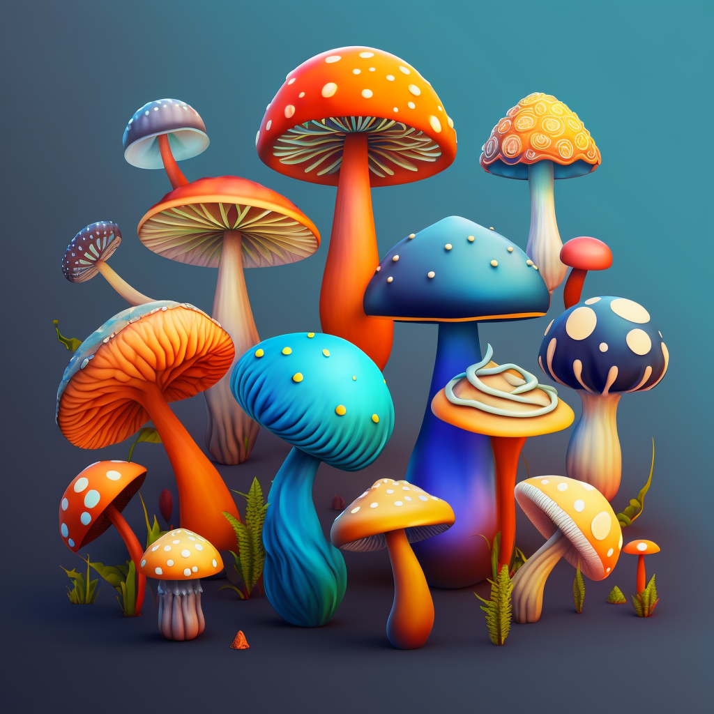

<!-- Improved compatibility of back to top link: See: https://github.com/othneildrew/Best-README-Template/pull/73 -->
<a name="readme-top"></a>
<!--
*** Thanks for checking out the Best-README-Template. If you have a suggestion
*** that would make this better, please fork the repo and create a pull request
*** or simply open an issue with the tag "enhancement".
*** Don't forget to give the project a star!
*** Thanks again! Now go create something AMAZING! :D
-->


<!-- PROJECT SHIELDS -->
<!--
*** I'm using markdown "reference style" links for readability.
*** Reference links are enclosed in brackets [ ] instead of parentheses ( ).
*** See the bottom of this document for the declaration of the reference variables
*** for contributors-url, forks-url, etc. This is an optional, concise syntax you may use.
*** https://www.markdownguide.org/basic-syntax/#reference-style-links
-->
[![Contributors][contributors-shield]][contributors-url]
[![Forks][forks-shield]][forks-url]
[![Stargazers][stars-shield]][stars-url]
[![Issues][issues-shield]][issues-url]
[![MIT License][license-shield]][license-url]
[![LinkedIn][linkedin-shield]][linkedin-url]


<!-- PROJECT LOGO -->
<br />
<div align="center">
  <a href="https://github.com/tianhew0121/Shroomification">
    
  </a>

<h3 align="center">Mushroom Toxicity Prediction</h3>

  <p align="center">
     Data-Driven Approaches to Edibility Classification
    <br />
    <a href="https://github.com/tianhew0121/Shroomification"><strong>Explore the docs »</strong></a>
    <br />
    <br />
    <a href="https://github.com/tianhew0121/Shroomification/blob/main/mushroom_classification.ipynb">View Demo</a>
  </p>
</div>


<!-- ABOUT THE PROJECT -->
## About The Project
Mushroom toxicity is a serious issue that affects millions of people worldwide. Identifying whether
a mushroom is edible or poisonous is a challenging task for humans without empirical knowledge,
given the wide range of mushroom species and the fact that many toxic and edible mushrooms have
similar appearances. Due to its high potential of misclassification and severe consequences in taking
the chance, it is worth having an algorithm in detecting mushroom toxicity that can be run on edge
devices.
In this project, we developed a predictive model for classifying the edibility of mushrooms us-
ing four data-driven approaches. We utilized a dataset of mushroom samples from UC Irvine with
known edibility labels and based our classification on physical characteristics such as cap and gill.
To develop our model, we used a combination of feature engineering, data preprocessing, and classi-
fication algorithms. Specifically, we employed linear regression, k-nearest neighbors, support vector
machines, multilayer perceptron, and Gaussian mixture model as our four data-driven approaches.
Our aim was to accurately predict the edibility of mushrooms, and we evaluated the performance of
each approach using metrics such as accuracy and f1 score.
Our results show that our model achieved high accuracy and F1 score, indicating its potential for
practical use in mushroom toxicity prediction. This project demonstrates the power of data-driven
approaches to address important real-world problems and highlights the importance of careful feature
selection and preprocessing in developing accurate predictive models.


<!-- GETTING STARTED -->
## Getting Started

To start with the project, just install all the requirements and follow the notebook.

### Prerequisites

Install all the requirement for this notebook to run.
  ```sh
  pip install -r requirements.txt
  ```


<!-- CONTACT -->
## Contact

Tianhe Wang - tianhewang33@gmail.com

Tingyu Zhang - tingyuz@usc.edu

Project Link: [https://github.com/tianhew0121/Shroomification](https://github.com/tianhew0121/Shroomification)


<!-- MARKDOWN LINKS & IMAGES -->
<!-- https://www.markdownguide.org/basic-syntax/#reference-style-links -->
[contributors-shield]: https://img.shields.io/github/contributors/tianhew0121/Shroomification.svg?style=for-the-badge
[contributors-url]: https://github.com/tianhew0121/Shroomification/graphs/contributors
[forks-shield]: https://img.shields.io/github/forks/tianhew0121/Shroomification.svg?style=for-the-badge
[forks-url]: https://github.com/tianhew0121/Shroomification/network/members
[stars-shield]: https://img.shields.io/github/stars/tianhew0121/Shroomification.svg?style=for-the-badge
[stars-url]: https://github.com/tianhew0121/Shroomification/stargazers
[issues-shield]: https://img.shields.io/github/issues/tianhew0121/Shroomification.svg?style=for-the-badge
[issues-url]: https://github.com/tianhew0121/Shroomification/issues
[license-shield]: https://img.shields.io/github/license/tianhew0121/Shroomification.svg?style=for-the-badge
[license-url]: https://github.com/tianhew0121/Shroomification/blob/master/LICENSE.txt
[linkedin-shield]: https://img.shields.io/badge/-LinkedIn-black.svg?style=for-the-badge&logo=linkedin&colorB=555
[linkedin-url]: https://linkedin.com/in/tianhe-wang-318591230
[product-screenshot]: images/screenshot.png
[Next.js]: https://img.shields.io/badge/next.js-000000?style=for-the-badge&logo=nextdotjs&logoColor=white
[Next-url]: https://nextjs.org/
[React.js]: https://img.shields.io/badge/React-20232A?style=for-the-badge&logo=react&logoColor=61DAFB
[React-url]: https://reactjs.org/
[Vue.js]: https://img.shields.io/badge/Vue.js-35495E?style=for-the-badge&logo=vuedotjs&logoColor=4FC08D
[Vue-url]: https://vuejs.org/
[Angular.io]: https://img.shields.io/badge/Angular-DD0031?style=for-the-badge&logo=angular&logoColor=white
[Angular-url]: https://angular.io/
[Svelte.dev]: https://img.shields.io/badge/Svelte-4A4A55?style=for-the-badge&logo=svelte&logoColor=FF3E00
[Svelte-url]: https://svelte.dev/
[Laravel.com]: https://img.shields.io/badge/Laravel-FF2D20?style=for-the-badge&logo=laravel&logoColor=white
[Laravel-url]: https://laravel.com
[Bootstrap.com]: https://img.shields.io/badge/Bootstrap-563D7C?style=for-the-badge&logo=bootstrap&logoColor=white
[Bootstrap-url]: https://getbootstrap.com
[JQuery.com]: https://img.shields.io/badge/jQuery-0769AD?style=for-the-badge&logo=jquery&logoColor=white
[JQuery-url]: https://jquery.com 
